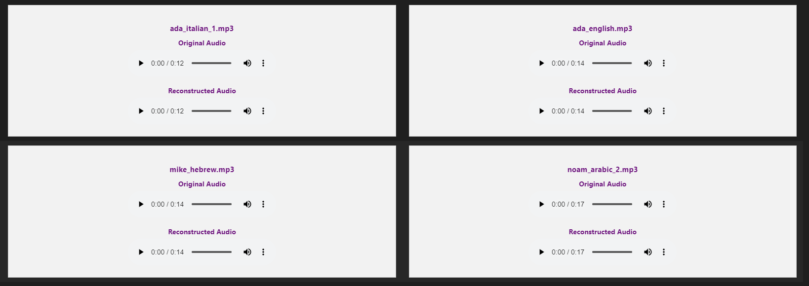
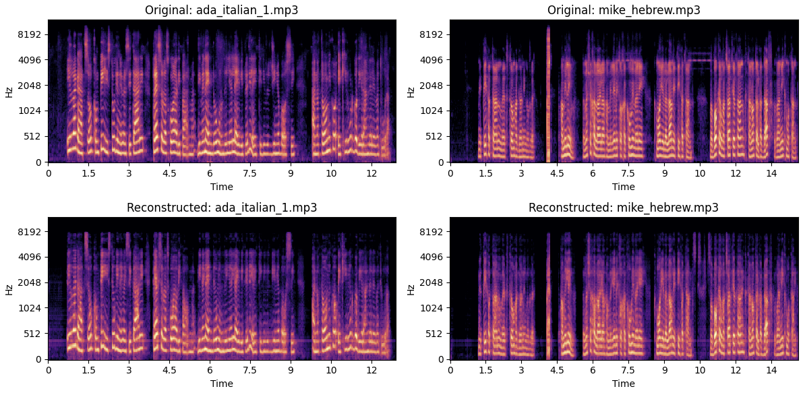

# Encodec Neural Audio Compression

This project implements the Encodec model, a neural audio codec designed for high-quality and efficient audio compression. Encodec is developed by FAIR (Facebook AI Research) and leverages deep learning to compress and reconstruct audio signals with minimal loss in quality.

## Model Demonstrations & Evaluation Notebook
In the evaluation directory, you can find a Jupyter notebook that demonstrates the Encodec model's performance on various audio samples. The notebook includes code snippets to load the model, compress audio files, and reconstruct the compressed audio signals. You can use this notebook to evaluate the model's performance on our or yours audio samples.



## Setup Instructions

Follow these steps to set up the project locally:

1. **Clone the repository**
   ```sh
   git clone https://github.com/matfain/Encodec-Neural-Audio-Compression.git
   cd Encodec-Neural-Audio-Compression
   ```

2. **Create a Conda environment**
   ```sh
   conda create --name encodec_env python=3.11
   conda activate encodec_env
   ```

3. **Install dependencies**
   ```sh
   pip install -r requirements.txt
   ```

4. **Download evaluation models**
    - Download the `evaluations.zip` file from [Google Drive](https://drive.google.com/file/d/1mr8Id_1uOwbTABbKJAsBjI-OFLmibyjW/view?usp=sharing).
    - Extract the contents and place the `evaluations` folder in the project root.

5. **Run the evaluation notebook**  
   Open `evaluations/model_demonstrations.ipynb` in Jupyter Notebook or Jupyter Lab and run the cells to test the model.

Enjoy experimenting with neural audio compression! 🚀
